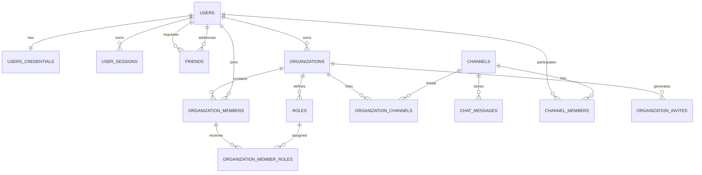

*This project has been created as part of the 42 curriculum by fraumarzhuk, grysha11, Db1zz.*

# Anteiku

## Description

Anteiku is a full-stack real-time communication platform inspired by Discord and Slack.
It combines direct messaging, server-based channels, role and permission management,
friend relations, notifications, and voice rooms.

The goal of the project is to build a production-style social platform that demonstrates:

- A modern web frontend and API-driven backend.
- Real-time communication over WebSockets.
- Secure authentication and authorization.
- Team-based development with CI/CD and modular architecture.

### Key Features

- User registration/login with JWT-based sessions.
- OAuth2 login (GitHub and Google).
- Profile management (including avatar upload).
- Friends system (requests, accept/remove, block/unblock).
- DM channels and server channels.
- Server management (create/join via invite, member management).
- Roles and permission masks per server.
- Real-time messaging and user status updates.
- Voice room join/create flow with WebRTC signaling support.
- Notification subsystem (Rust service + Kafka + Cassandra).
- Internationalization (English, Russian, German).
- OpenAPI-based API documentation and generated delegates.

## Instructions

### Prerequisites

- Docker Engine 24+ and Docker Compose v2.
- GNU Make.
- (Local frontend development) Node.js 20.x and npm 10+.
- (Local backend development) JDK 25 and Maven Wrapper.
- Optional tools: curl, git.

### Environment Setup

1. Copy environment template and fill values:

```bash
cp .env.example .env
```

2. Configure at least these variables in .env:

- Database: POSTGRES_DB, POSTGRES_USER, POSTGRES_PASSWORD
- Auth/OAuth: GITHUB_CLIENT_ID, GITHUB_CLIENT_SECRET, GOOGLE_CLIENT_ID, GOOGLE_CLIENT_SECRET
- JWT: JWT_PRIVATE_KEY, JWT_PUBLIC_KEY
- Media: CLOUDINARY_CLOUD_NAME, CLOUDINARY_API_KEY, CLOUDINARY_API_SECRET
- Optional observability: ELASTIC_PASSWORD, KIBANA_PASSWORD
- Voice/RTC: REACT_APP_STUN_SERVER, REACT_APP_SIGNALING_SERVER
- Notifications: NOTIFY_PROD_ADDR

### Run with Docker (recommended)

1. Start app stack:

```bash
make up
```

2. Start app stack + ELK:

```bash
make up-elk
```

3. Stop stack:

```bash
make down
```

4. Stop stack including ELK:

```bash
make down-elk
```

### Local Development

#### Backend

```bash
cd Backend
./mvnw clean verify
./mvnw spring-boot:run
```

#### Frontend

```bash
cd Frontend/app_react
npm install
npm test -- --watchAll=false
npm start
```

### Default Service Ports

- Frontend: 3000
- Backend API: 8080
- Backend debug: 5005
- PostgreSQL: 5432
- Kafka: 9092
- Cassandra: 9042
- Elasticsearch: 9200
- Kibana: 5601
- Logstash input: 50000

### API Documentation

- OpenAPI spec is available at Backend/src/main/resources/static/openapi.yaml.
- Swagger UI is exposed by Springdoc at runtime.

## Team Information

The role assignment below is based on repository history analysis and should be adjusted if your team used different formal role names.

### fraumarzhuk

- Assigned role(s): Product Owner + Frontend Lead + Backend Developer
- Responsibilities:
  - User-facing UX flows and frontend architecture.
  - Authentication screens and profile/friends UI.
  - Integration of client contexts, hooks, and i18n behavior.
  - Early backend structure and service groundwork.
  - API and data-layer foundation.


### grysha11

- Assigned role(s): Full-stack Developer + DevOps Support
- Responsibilities:
  - Backend and frontend feature delivery.
  - Docker/compose and ELK-related integration work.
  - Cross-cutting implementation in chat/server modules.


### Db1zz

- Assigned role(s): Tech Lead (Backend/Infra) + Systems Developer
- Responsibilities:
  - Core backend implementation and service orchestration.
  - Rust Notify subsystem (Kafka/Cassandra consumer stack).
  - Voice and notification pipeline integration.

## Project Management

### Work Organization

- The project was organized in parallel streams:
  - Frontend stream (UI, hooks, state management, tests).
  - Backend stream (API, security, domain services, persistence).
  - Infrastructure stream (Docker, CI/CD, observability, notifications).
- Integration was performed incrementally through branch-based merges and regular synchronization.

### Management Tools

- Git and GitHub for version control and review flow.
- GitHub Actions for CI/CD:
  - Frontend workflow (test + build)
  - Backend workflow (maven verify + artifact upload)

### Communication Channels

- Repository evidence confirms asynchronous communication through GitHub commits/PR workflow.
- If your team used Discord/Slack/42 intra chat for meetings and task planning, add that explicitly here for evaluation completeness.

## Technical Stack

### Frontend

- React 19 + TypeScript
- react-router-dom
- i18next + react-i18next
- STOMP client and socket integrations
- Tailwind CSS + custom CSS
- Jest + Testing Library

### Backend

- Java 25
- Spring Boot 4
- Spring Security + OAuth2 client
- Spring Web + WebSocket/STOMP
- Spring Data JPA + Hibernate
- OpenAPI Generator + Springdoc/Swagger UI
- JWT (jjwt)

### Databases and Messaging

- PostgreSQL (main relational data store)
- Cassandra (notification-oriented data in Notify subsystem)
- Kafka (event and notification pipeline)

### Other Significant Technologies

- Rust/Cargo for Notify microservice.
- Cloudinary for image upload/storage.
- ELK stack (Elasticsearch, Logstash, Kibana) for logging and observability.
- Docker Compose for local orchestration.

### Why These Choices

- React + TypeScript: strong ecosystem and maintainable typed frontend code.
- Spring Boot: fast delivery of secure API and real-time backend features.
- PostgreSQL: reliable relational model matching user/server/message entities.
- Kafka + Cassandra + Rust: scalable notification pipeline with low overhead.
- Docker Compose: reproducible local environment for multi-service integration.

## Database Schema

The primary relational schema is initialized through Backend/docker-entrypoint-initdb.d/init.sql.

### ER Diagram (High-level)



### Main Tables and Key Fields

- users: id UUID, username, display_name, status, about, picture, role.
- users_credentials: user_id FK, email, password.
- user_sessions: session tokens and expiration metadata.
- friends: requester_id/addressee_id, relation status.
- organizations: id, name, owner_id.
- roles: organization_id, name, permission_mask.
- organization_members: organization_id, user_id.
- organization_member_roles: member_id + role_id (join table).
- channels: id, organization_id, type, name.
- organization_channels: organization_id + channel_id (join table).
- channel_members: channel_id + user_id.
- chat_messages: channel_id, sender_id, content, created_at.
- organization_invites: invite code, organization_id, creator_id, expires_at.

## Features List

The list below summarizes implemented functionality and primary contributors inferred from commit history for related files.

1. Authentication and Session Management
	- Functionality: register/login/refresh/logout with JWT sessions and cookie flow.
	- Contributors: fraumarzhuk, Db1zz, grysha11.
2. OAuth2 Login (GitHub/Google)
	- Functionality: external provider login with Spring Security OAuth2.
	- Contributors: fraumarzhuk, Db1zz.
3. User Profile and Avatar Upload
	- Functionality: editable profile fields and image upload via Cloudinary.
	- Contributors: fraumarzhuk, Db1zz.
4. Friends System
	- Functionality: send/accept/remove requests, list friends, block/unblock users.
	- Contributors: fraumarzhuk, grysha11, Db1zz.
5. Direct Messaging and Channel Messaging
	- Functionality: DM channel retrieval, paginated messages, real-time chat updates.
	- Contributors: grysha11, Db1zz, fraumarzhuk.
6. Servers (Organizations), Channels, Invites
	- Functionality: create/join servers, manage channels, invite by code.
	- Contributors: fraumarzhuk, grysha11, Db1zz.
7. Roles and Permission System
	- Functionality: role CRUD, permission masks, role assignment to members.
	- Contributors: fraumarzhuk, grysha11, Db1zz.
8. Voice Rooms
	- Functionality: join/create voice rooms and WebRTC signaling transport.
	- Contributors: Db1zz, grysha11, fraumarzhuk.
9. Notification Subsystem
	- Functionality: event emission in backend + Rust Notify service consuming Kafka.
	- Contributors: Db1zz, grysha11, fraumarzhuk.
10. Internationalization
	- Functionality: multilingual UI resources (en, ru, de) and language switching.
	- Contributors: fraumarzhuk, grysha11.
11. CI/CD Pipelines
	- Functionality: backend and frontend GitHub Actions test/build workflows.
	- Contributors: grysha11 and team.

## Modules

Chosen modules are based on modules.MD and current implementation.

### Summary and Points

1. Major: Framework for frontend and backend (2 pts)
2. Major: Real-time features using WebSockets (2 pts)
3. Major: Public API with database interaction and endpoint coverage (2 pts)
4. Major: User interaction system (chat/profile/friends) (2 pts)
5. Major: Public API module listed second time in modules.MD (2 pts)
6. Minor: ORM for database (1 pt)
7. Minor: File upload and management (1 pt)
8. Minor: Multi-language support (1 pt)
9. Major: Standard user management/authentication (2 pts)
10. Minor: OAuth2 remote authentication (1 pt)
11. Major: Advanced permissions system (2 pts)

Total (as tracked in modules.MD): 18 points

### Implementation and Justification

1. Framework module
	- Why: fast development with strong ecosystem and maintainability.
	- How: React/TypeScript frontend and Spring Boot backend.
	- Contributors: all core team members.
2. Real-time module
	- Why: chat/voice UX depends on low-latency updates.
	- How: STOMP/WebSocket controllers, socket handlers, frontend hooks.
	- Contributors: Db1zz, grysha11, fraumarzhuk.
3. Public API module(s)
	- Why: clean separation between frontend and backend; testability.
	- How: OpenAPI schema, generated delegates, 30+ documented paths.
	- Contributors: Db1zz, grysha11, fraumarzhuk.
4. User interaction module
	- Why: central to social/chat platform value.
	- How: friends services, DM/server channels, profile APIs/UI.
	- Contributors: fraumarzhuk, grysha11, Db1zz.
5. ORM module
	- Why: reduce boilerplate and improve persistence consistency.
	- How: JPA repositories/entities with Hibernate.
	- Contributors: Db1zz, grysha11.
6. File upload module
	- Why: profile personalization and identity in chat context.
	- How: multipart endpoint + Cloudinary integration.
	- Contributors: fraumarzhuk, Db1zz.
7. i18n module
	- Why: accessibility and broader usability.
	- How: i18next resources and language selector.
	- Contributors: fraumarzhuk, grysha11.
8. Standard auth module
	- Why: secure account lifecycle and protected routes.
	- How: credentials + JWT + session repository + guards.
	- Contributors: Db1zz, fraumarzhuk.
9. OAuth2 module
	- Why: better UX and trusted external identity providers.
	- How: Spring OAuth2 client registration and frontend OAuth entry.
	- Contributors: fraumarzhuk, Db1zz.
10. Advanced permissions module
	- Why: server moderation and role-based governance.
	- How: permission masks, role assignment API, frontend permission hooks.
	- Contributors: fraumarzhuk, grysha11, Db1zz.

## Individual Contributions

This section is intentionally explicit for evaluation transparency.

### fraumarzhuk

- Major frontend implementation across auth, profile, friends, and UI architecture.
- Significant contribution to backend integration points and API usage wiring.
- i18n resources and multilingual UX.
- Challenge: synchronize rapidly evolving backend contracts with frontend state model.
- Resolution: incremental adapter/hook updates and test coverage in frontend modules.

### grysha11

- Full-stack feature delivery across chat, server management, and infra files.
- Contributions to compose/Makefile/ELK and CI workflow evolution.
- Challenge: keeping real-time and standard request/response flows coherent.
- Resolution: separation into dedicated hooks/services and iterative integration testing.

### Db1zz

- Heavy backend contribution (security, services, notification and voice subsystems).
- Ownership of Rust Notify service and messaging stack integration.
- Challenge: connecting multiple distributed components (Kafka, Cassandra, backend events).
- Resolution: service isolation, explicit docker composition, and protocol-level contracts.

## Resources

### Classic References

- Spring Boot Documentation: https://docs.spring.io/spring-boot/documentation.html
- Spring Security OAuth2 Client: https://docs.spring.io/spring-security/reference/servlet/oauth2/
- Spring WebSocket/STOMP: https://docs.spring.io/spring-framework/reference/web/websocket.html
- React Documentation: https://react.dev/
- TypeScript Handbook: https://www.typescriptlang.org/docs/
- i18next Documentation: https://www.i18next.com/
- OpenAPI Specification: https://spec.openapis.org/oas/latest.html
- PostgreSQL Docs: https://www.postgresql.org/docs/
- Apache Kafka Docs: https://kafka.apache.org/documentation/
- Apache Cassandra Docs: https://cassandra.apache.org/doc/
- Rust Book: https://doc.rust-lang.org/book/
- Elastic Stack Docs: https://www.elastic.co/guide/index.html

### AI Usage Disclosure

AI tools were used as assistants, not as autonomous project owners.

- Used for:
  - Drafting/refining documentation and structure.
  - Generating or polishing boilerplate snippets.
  - Refactoring suggestions and debugging hints.
  - Test idea generation and wording improvements.
- Not used for:
  - Blindly replacing architectural decisions.
  - Automatic acceptance of unreviewed code.
- Human validation:
  - All final code and architecture decisions were reviewed and integrated by team members.

## Known Limitations and Next Improvements

- Some optional project management details (meeting cadence/external comm tools) are not fully traceable from repository artifacts and should be filled with your exact team workflow.
- Hardening opportunities remain for production deployment (secret management, stricter security policies, scaling profiles).
- Additional automated integration tests can be added for full end-to-end voice and notification scenarios.